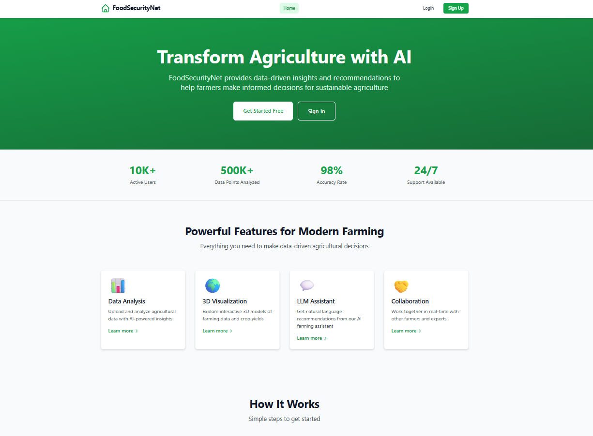
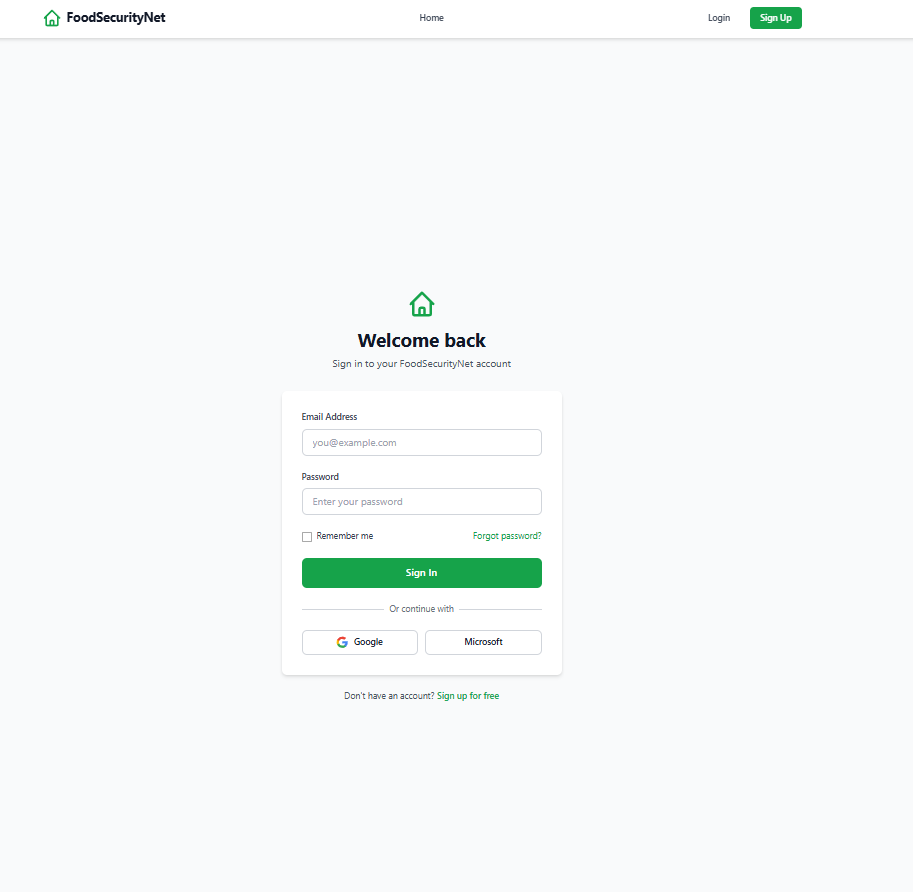
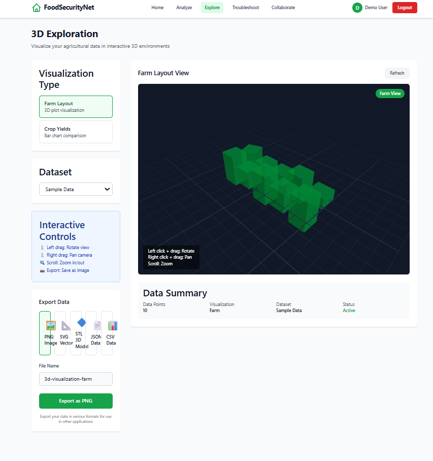
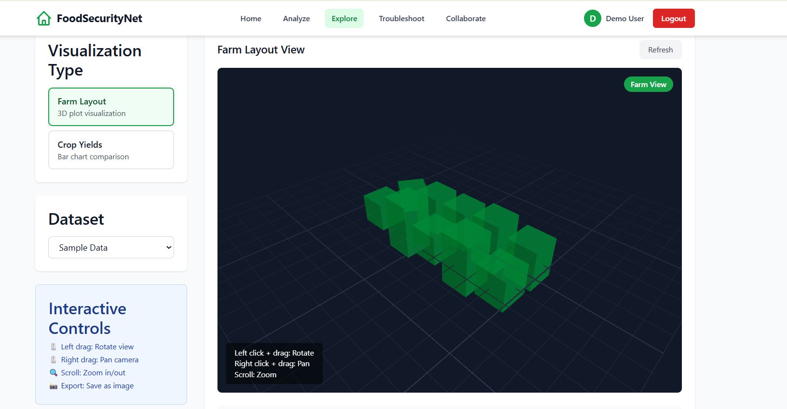
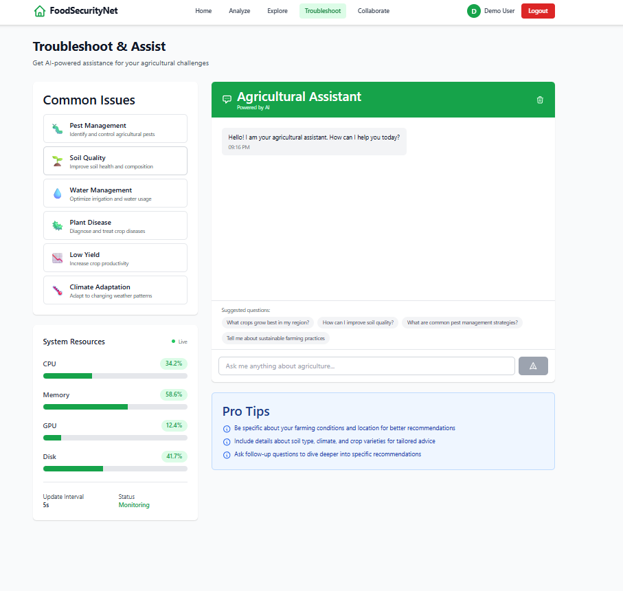
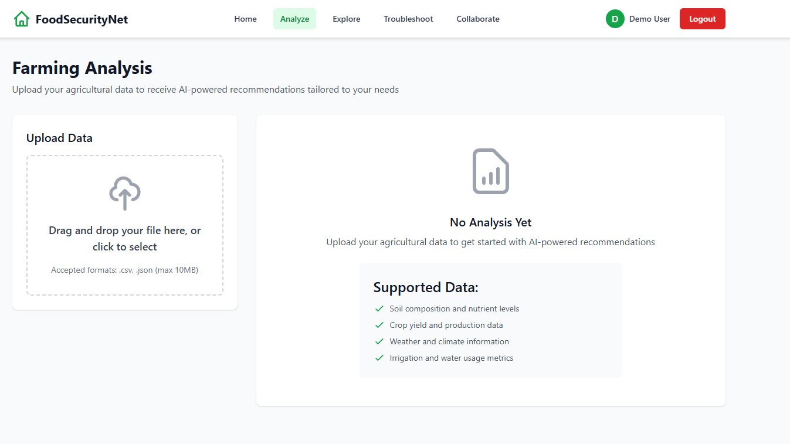
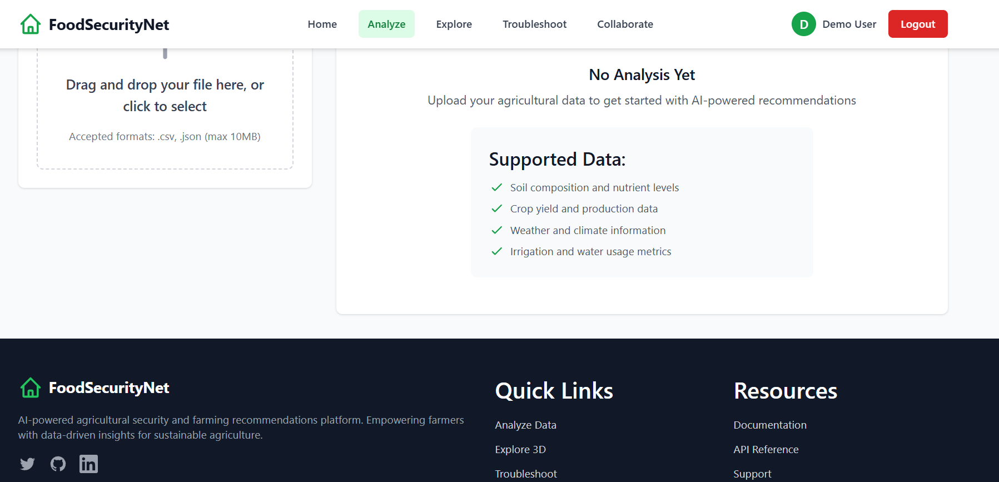
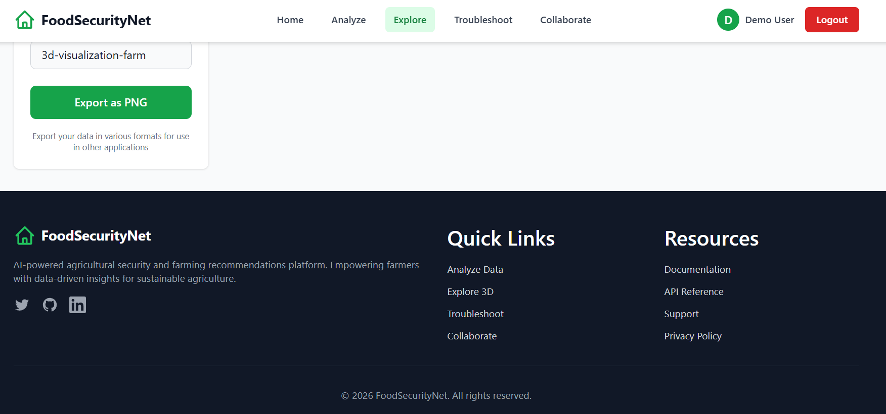
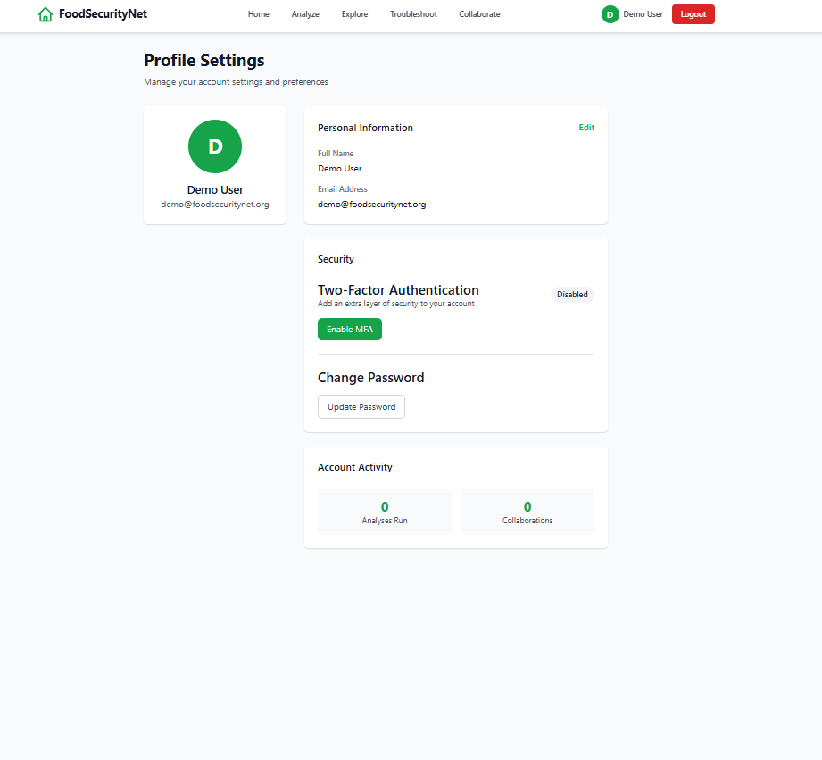

# FoodSecurityNet

FoodSecurityNet is a multi-service agriculture platform with a React frontend, Spring-based backend services, and Python AI components. The current app focuses on data upload and analysis, 3D exploration, AI-assisted troubleshooting, collaboration sessions, and authenticated user workflows routed through an API gateway.

## Current Status

- Frontend runs on Vite and talks to the API gateway on `http://localhost:8080`
- Collaboration uses STOMP over SockJS, not `socket.io`
- A mock API server is available through [`demo-server.js`](/Users/sekac/Documents/My-Projects-LOCAL/FoodSecurityNet/demo-server.js) for local UI testing

## Screenshots

### Landing Page



### Login



### Explore





### Troubleshoot



### Analyze





### Footer And Export Detail



### Additional App View



## Repo Layout

- [`frontend`](/Users/sekac/Documents/My-Projects-LOCAL/FoodSecurityNet/frontend): React/Vite client
- [`backend/api-gateway`](/Users/sekac/Documents/My-Projects-LOCAL/FoodSecurityNet/backend/api-gateway): request routing and security boundary
- [`backend/auth-service`](/Users/sekac/Documents/My-Projects-LOCAL/FoodSecurityNet/backend/auth-service): auth, MFA, profile APIs
- [`backend/collaboration-service`](/Users/sekac/Documents/My-Projects-LOCAL/FoodSecurityNet/backend/collaboration-service): collaboration sessions and WebSocket endpoints
- [`backend/llm-service`](/Users/sekac/Documents/My-Projects-LOCAL/FoodSecurityNet/backend/llm-service): Java-side LLM integration
- [`ai-model`](/Users/sekac/Documents/My-Projects-LOCAL/FoodSecurityNet/ai-model): Python AI and model docs
- [`tests/e2e`](/Users/sekac/Documents/My-Projects-LOCAL/FoodSecurityNet/tests/e2e): end-to-end test assets

## Key Features

- Authenticated analysis workflow with file upload and AI-generated insights
- Interactive 3D exploration for farm layouts and crop datasets
- AI troubleshooting chat with resource monitoring
- Collaboration session listing, creation, chat history, and live session events
- Export support for PNG, SVG, STL, JSON, and CSV
- Accessibility and security hardening including skip links, route announcements, MFA dialog improvements, and stronger security headers

## Local Development

### Frontend

```bash
cd frontend
npm install
npm run dev
```

The frontend runs at [http://127.0.0.1:3000](http://127.0.0.1:3000).

### Mock API

```bash
node demo-server.js
```

The mock server runs at `http://localhost:8080`.

Demo credentials:

- Email: `demo@foodsecuritynet.org`
- Password: `Demo123!`

### Frontend Build

```bash
cd frontend
npm run build
```

## Documentation

- Compliance readiness: [`docs/COMPLIANCE_READINESS.md`](/Users/sekac/Documents/My-Projects-LOCAL/FoodSecurityNet/docs/COMPLIANCE_READINESS.md)
- Frontend details: [`frontend/README.md`](/Users/sekac/Documents/My-Projects-LOCAL/FoodSecurityNet/frontend/README.md)
- API gateway details: [`backend/api-gateway/README.md`](/Users/sekac/Documents/My-Projects-LOCAL/FoodSecurityNet/backend/api-gateway/README.md)
- AI model details: [`ai-model/README.md`](/Users/sekac/Documents/My-Projects-LOCAL/FoodSecurityNet/ai-model/README.md)
- AI model quickstart: [`ai-model/QUICKSTART.md`](/Users/sekac/Documents/My-Projects-LOCAL/FoodSecurityNet/ai-model/QUICKSTART.md)
- AI model testing: [`ai-model/TESTING.md`](/Users/sekac/Documents/My-Projects-LOCAL/FoodSecurityNet/ai-model/TESTING.md)

## Verification Notes

- Frontend production build has been verified locally with `npm.cmd run build`
- Java service compilation has not been verified in this environment because Maven is not installed

## License

Apache License 2.0. See [`LICENSE`](/Users/sekac/Documents/My-Projects-LOCAL/FoodSecurityNet/LICENSE).
